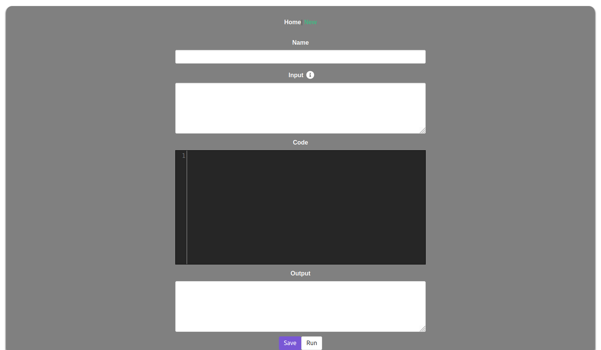

# coding-problem-pyodide

Save and run Python coding snippets or problems entirely in the browser with Wasm through [pyodide](https://github.com/iodide-project/pyodide).

NumPy is included by default. To add other packages, in `runCode()` in `New.vue`, add the packages included in pyodide [shown here](https://github.com/iodide-project/pyodide/tree/master/packages), including Scipy, Matplotlib, scikit-learn, and Pandas.



Note that pyodide does not support returning stdout—it only goes to the console. To print out a variable to the output, simply list the variable as if it was a python shell.

## Project setup

```
yarn install
```

### Compiles and hot-reloads for development

```
yarn run serve
```

### Compiles and minifies for production

```
yarn run build
```
